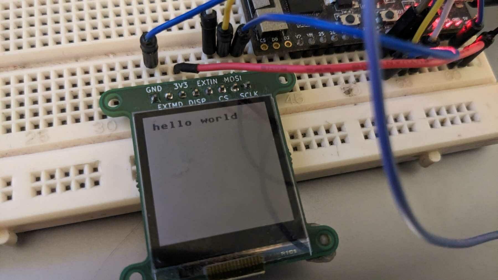

I've been working with Sharp's [LS013B7DH03](https://www.digikey.ie/en/products/detail/sharp-microelectronics/LS013B7DH03/5300387) memory LCD. While looking for a driver to use with MicroPython I realised that they all invert some COM signal every time they update the display, usually with a vague comment about how you have to update the display regularly. The EXTCOMIN and EXTMODE pins also baffled me until I eventually found [this handy bit of documentation](https://github.com/peterhinch/micropython-nano-gui/blob/master/DRIVERS.md#4-drivers-for-sharp-displays) by Peter Hinch that explains it.

So basically one way or another the COM signal has to be inverted regularly or you'll gradually damage the LCD. I agree that doing that in software seems to be easier. For my application I want to keep the ESP32 in deep sleep as long as possible and waking from deep sleep takes a significant part of a second, so waking every second or so to invert the signal is out of the question.

The ESP32 also has a ULP (Ultra Low Power) Coprocessor, so I got the idea to use that to periodically invert the COM signal. But then I thought.. Is it possible to just have the entire display driver live in the ULP processor with the entire display buffer in the 8K of RTC memory along with the code? And the answer turns out to be.. kinda. But it is just a bit too slow.

The ULP is extremely limited. It has 4 general purpose registers, a weird hidden 8-bit register that's only really useful for loops and very few instructions. It is clocked from the ±8Mhz clock. Seems like you can maybe also clock it from 40Mhz/4 = ±10Mhz but I haven't figured out how to do that yet. Instructions take 4, 6, 8 or 12 clock cycles to execute and load the next instruction. The macros for reading/writing peripheral registers take who knows how many more. It can only access memory at 32-bit word boundaries, but it can only read/write to the lower 16 bits. The upper 16-bits of each 32-bit word is inaccessible.

The display is 128x128 monochrome, so a full screen buffer is 2048 bytes, but because half the memory is inaccessible it actually takes 4096 bytes, or 1024 32-bit words. ie. exactly half of the 8K of RTC memory. The ULP is designed to do ADC readings or monitor something over an I2C bus or maybe check some pins and then wake up the main processor. The display talks SPI, the ULP has no access to SPI hardware. So I would have to bitbang it..

I've never written anything in assembly before (let alone for such an obscure target), so I had no feel for what kind of speed I'd get. I decided to just wing it and if it doesn't work out I could always go back to plan A which was to only run the ULP while the main processor is asleep and have the main processor take over the SPI bus to quickly update the display otherwise.

So my driver borrows from [MicroPython nano-gui's driver](https://github.com/peterhinch/micropython-nano-gui/blob/master/drivers/sharp/sharp.py) in that it subclasses framebuf.FrameBuffer, but all the Python code does is it has a 2048 byte screen buffer that it copies over to the RTC memory in the "only use half of it" weird style that the ULP understands. This way it can behave just like a normal MicroPython framebuffer display driver. The ULP code basically then just stores the last COM signal, wakes up periodically, inverts it and copies the buffer contents to the display from that patch of RTC memory. Then goes back to sleep.

I optimised this a fair amount and.. it takes about 140ms-ish according to my oscilloscope to copy over a frame. I can _maybe_ get that down closer to 100ms which would be 10 frames per second and I could _maybe_ boost that by a further 20% if I can switch to a faster clock, but that's still gonna be in the range of 10 FPS for full screen updates which isn't great. It should be possible to speed up "off" pixels by a bit and to make it only update changed lines, but I'm not crazy about those limitations - I like things to perform predictably.

This was interesting and I learned a lot. I put my hacky code up as a [Gist](https://gist.github.com/lerouxb/0ba2b5d5318ad0c1199148bf4e72e4fd).

What I'll rather end up doing would be to copy the frame data to the display using the main processor from the main program and then only use the ULP during deep sleep with the ["maintain memory internal data"](https://mm.digikey.com/Volume0/opasdata/d220001/medias/docus/929/LS013B7DH03_Spec.pdf) mode where you send it one byte including the inverted COM bit. I was hoping to avoid that because that has different bits of complexity: You have to make sure that control of the SPI line gets properly handed off between the main processor and the ULP.

